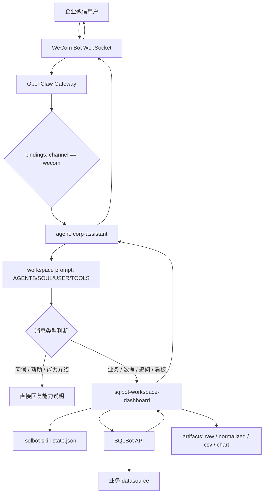
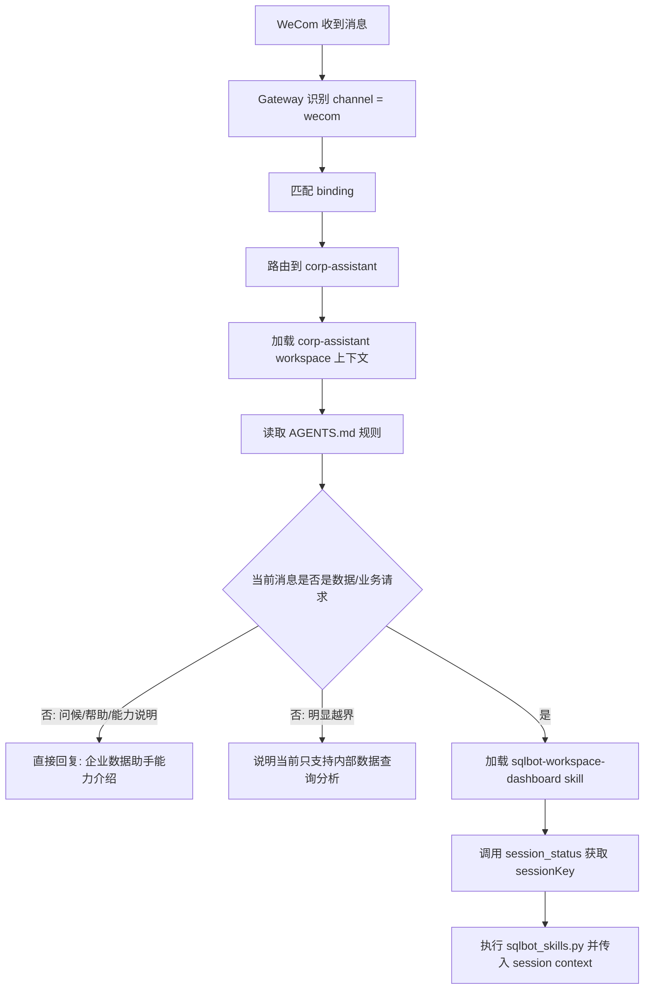
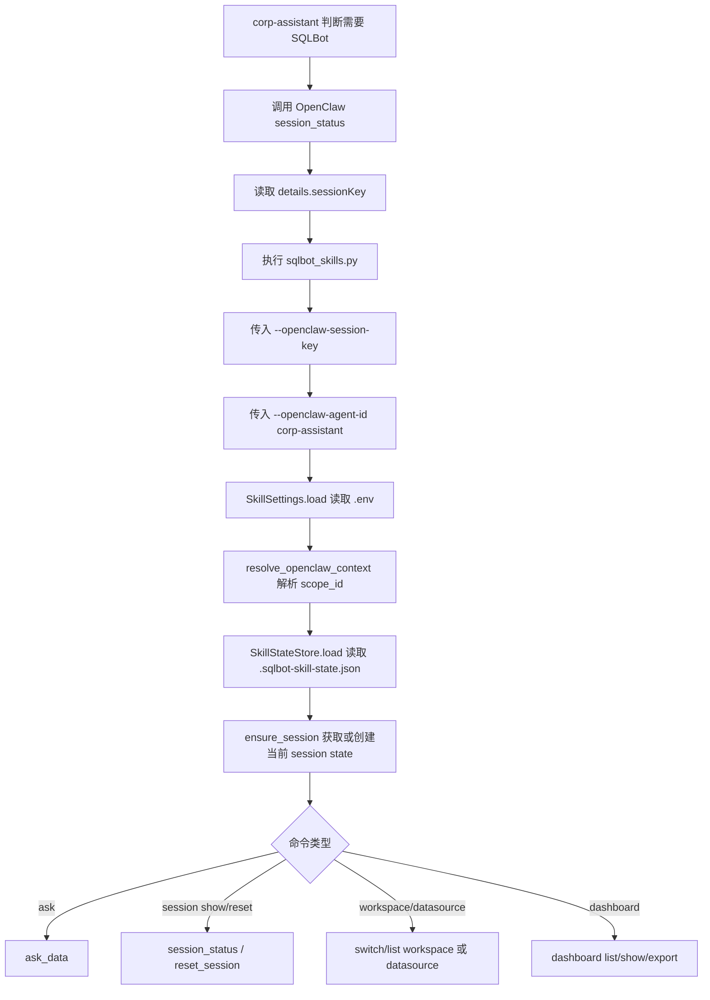
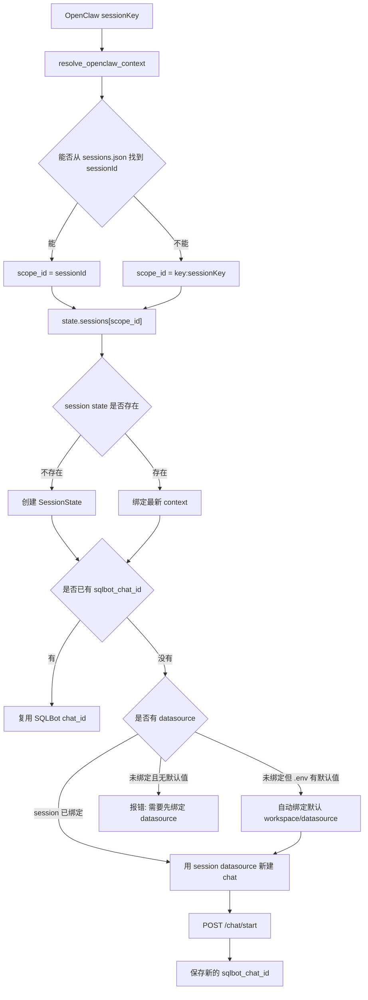
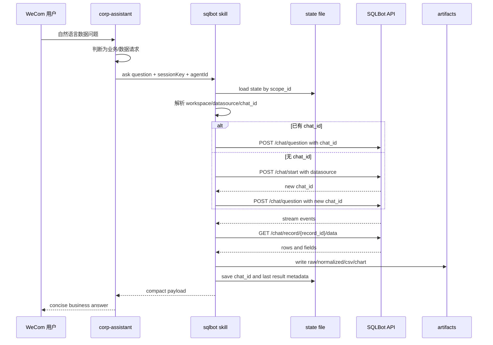
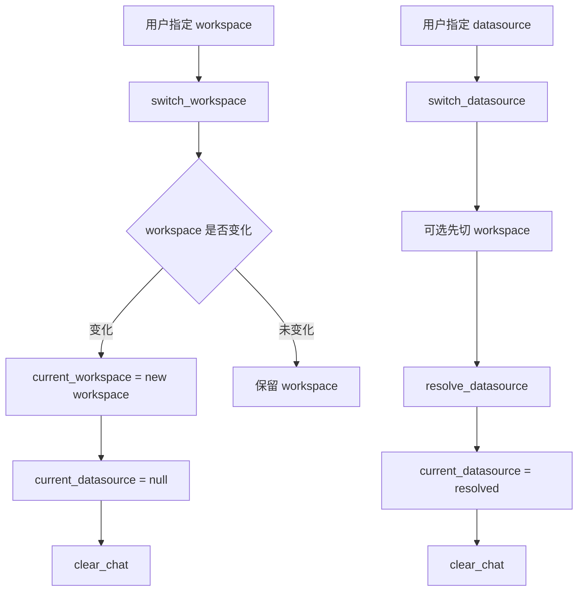
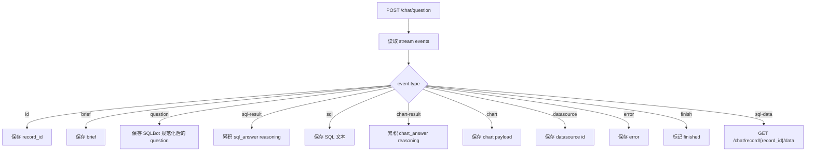
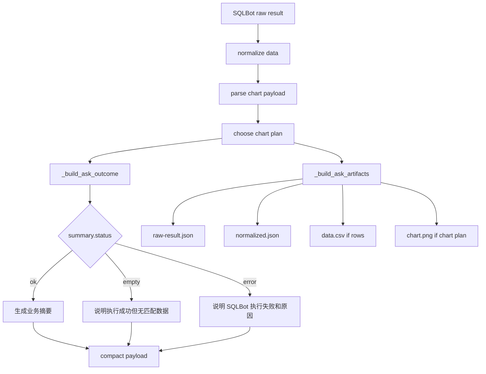
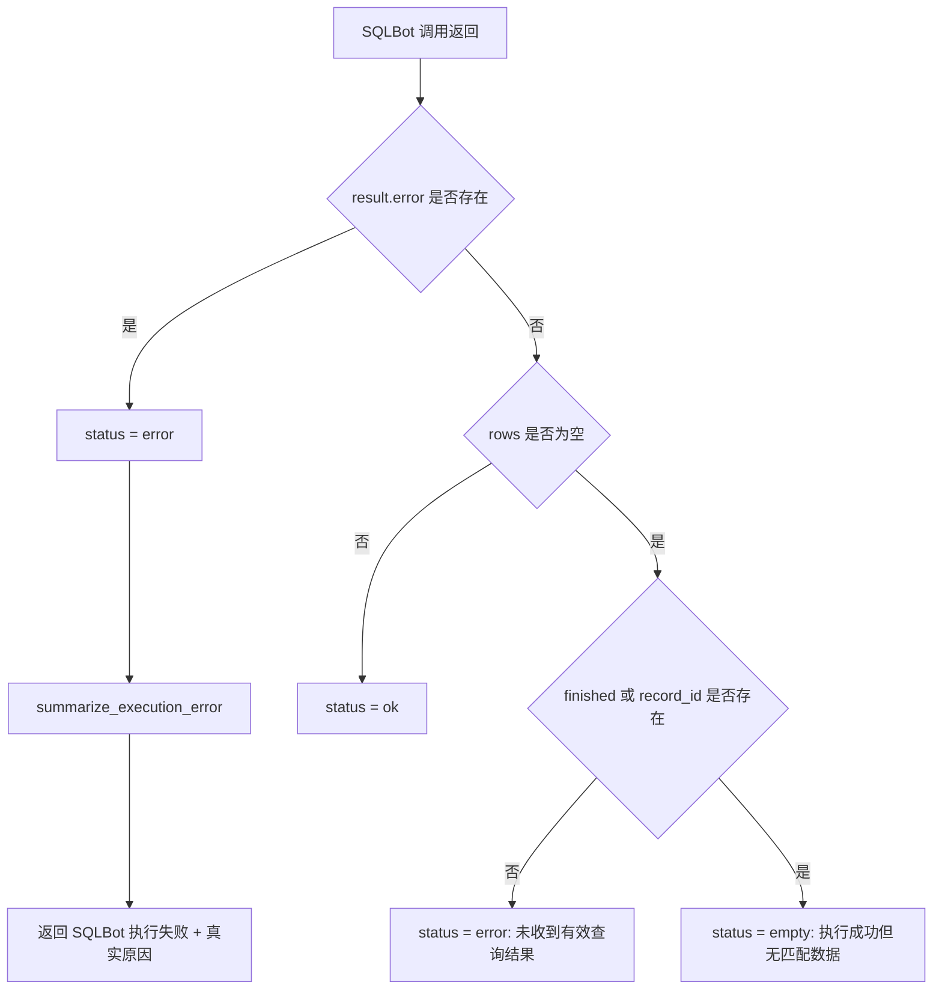
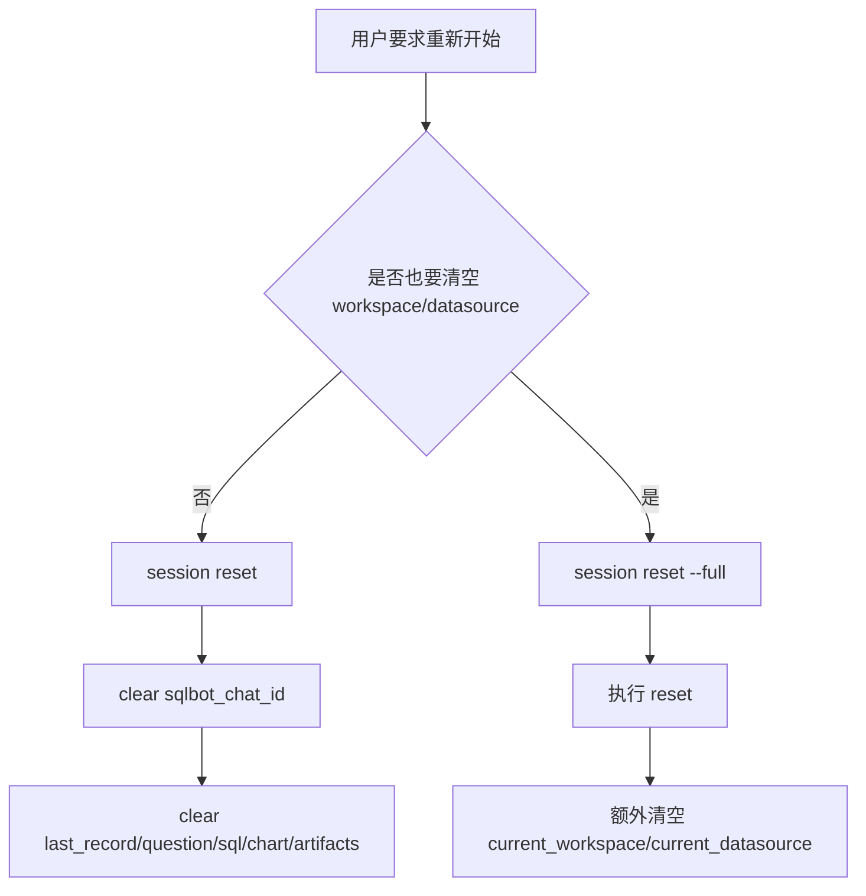

# Corp Assistant 与 SQLBot Skill 工作流程

更新时间：2026-04-22  
维护位置：`/root/.openclaw/workspace/memory/corp-assistant-sqlbot-workflow.md`  
适用对象：`corp-assistant` 生产 agent、`sqlbot-workspace-dashboard` skill、WeCom 入口路由

## 1. 文档目标

本文用于说明当前 `corp-assistant` 生产 agent 的完整工作流程，以及它调用 SQLBot skill 的内部状态、会话、错误处理和产物生成机制。

目标：

- 让后来维护者能快速理解 WeCom 消息如何进入 `corp-assistant`
- 说明自然语言问题如何路由到 SQLBot
- 说明一个 OpenClaw session 如何绑定一个 SQLBot `chat_id`
- 说明 workspace、datasource、chat、record、artifact 的生命周期
- 为后续重新设计、拆分、扩展或重构提供依据

不包含：

- 任何 WeCom `secret`
- 任何 SQLBot access key 或 secret key
- 具体业务数据库字段设计

## 2. 当前结论摘要

当前设计是一个窄口生产服务：

| 层级 | 当前职责 | 关键约束 |
|---|---|---|
| WeCom channel | 接收企业微信消息 | Bot WebSocket 模式，凭证在 `openclaw.json` |
| Gateway binding | 把 `wecom` 渠道路由到 `corp-assistant` | 路由在 Gateway 层决定，不靠 prompt 猜测 |
| `corp-assistant` | 企业内部数据助手 | 不做通用助手，不使用 main 的个人风格 |
| `sqlbot-workspace-dashboard` | SQLBot 问数、会话绑定、看板导出 | 每次生产调用必须显式携带 OpenClaw session context |
| SQLBot | 生成 SQL、执行查询、返回图表/数据 | 具体 SQL 能力由 SQLBot 服务和 datasource 决定 |

核心机制：

- 自然语言业务/数据问题默认走 SQLBot，不再要求用户以 `查询` 开头
- 问候、能力介绍、帮助说明不调用 SQLBot
- 一个 OpenClaw session 对应一个 SQLBot ask-data chat
- 每个 session 的 `chat_id` 保存在 `.sqlbot-skill-state.json`
- 如果当前 session 没有 `chat_id`，skill 会在已有或默认 datasource 上新建 SQLBot chat
- 如果 workspace 或 datasource 被切换，旧 `chat_id` 会被清空
- SQLBot 返回后会生成 compact JSON，并落地 `raw-result.json`、`normalized.json`、可选 CSV 和 chart PNG

## 3. 关键文件

| 文件 | 作用 |
|---|---|
| `/root/.openclaw/openclaw.json` | Gateway、channel、agent、binding、model、plugin 总配置 |
| `/root/.openclaw/workspace-corp-assistant-prod/AGENTS.md` | `corp-assistant` 的生产行为、路由、边界和开场白规范 |
| `/root/.openclaw/workspace-corp-assistant-prod/SOUL.md` | `corp-assistant` 的风格约束 |
| `/root/.openclaw/workspace-corp-assistant-prod/USER.md` | 企业内部用户假设 |
| `/root/.openclaw/workspace-corp-assistant-prod/TOOLS.md` | 生产工具边界 |
| `/root/.openclaw/workspace-corp-assistant-prod/skills/sqlbot-workspace-dashboard/SKILL.md` | skill 使用规范和命令模板 |
| `/root/.openclaw/workspace-corp-assistant-prod/skills/sqlbot-workspace-dashboard/sqlbot_skills.py` | SQLBot skill 实现 |
| `/root/.openclaw/workspace-corp-assistant-prod/skills/sqlbot-workspace-dashboard/.env` | SQLBot endpoint、API key、默认 workspace/datasource |
| `/root/.openclaw/workspace-corp-assistant-prod/skills/sqlbot-workspace-dashboard/.sqlbot-skill-state.json` | session -> SQLBot chat 状态 |
| `/root/.openclaw/workspace-corp-assistant-prod/skills/sqlbot-workspace-dashboard/artifacts/` | 查询结果、图表、CSV、原始 JSON 产物 |

## 4. 总体架构图



## 5. WeCom 到 Agent 的入口流程



当前路由边界：

| 输入类型 | 行为 |
|---|---|
| `你好`、`你能做什么` | 直接回复能力说明，不调用 SQLBot |
| `本周各客户出货量排行` | 默认调用 SQLBot |
| `继续按地区拆分` | 复用当前 session 的 SQLBot chat |
| `重新开始`、`换个数据源` | 调用 session reset 或 datasource switch |
| `帮我写代码`、`查网页新闻` | 不调用 SQLBot，说明当前生产范围 |

## 6. `corp-assistant` 行为规范

当前生产定位：

- `corp-assistant` 是 WeCom 面向企业用户的生产服务 agent
- 它不是 `main` agent
- 它不是个人助理
- 它不是通用聊天/编码/联网搜索助手
- 当前核心能力是 SQLBot 内部数据分析

开场回复要求：

- 像智能内部助手，不像命令解析器
- 明确告诉用户可以直接问，不需要加 `查询`
- 简要说明能力：查指标、汇总对比、继续追问、切换数据源、重新开始分析、导出图表/看板
- 不暴露 tool 名称、文件路径、内部 session key、debug 细节

推荐开场模板：

```text
你好，我是企业数据助手。你可以直接问我业务数据问题，不需要加“查询”。
目前我可以帮你查指标、做汇总对比、继续追问明细、切换数据源或重新开始分析；
如果已配置，也可以导出图表或看板。
比如：本周各客户出货量排行、今年泰国榴莲税率、按地区拆分上月销售额。
```

## 7. SQLBot Skill 调用总流程



生产调用必须携带：

```bash
--openclaw-session-key "<sessionKey>" --openclaw-agent-id "corp-assistant"
```

禁止生产流量使用：

```bash
--allow-default-scope
```

原因：

- 不带 session context 会落入 `default` 或错误 scope
- 多个 WeCom 用户/会话可能互相污染 SQLBot `chat_id`
- datasource、last question、artifacts 会串到错误用户或错误会话

## 8. Session 与 Chat ID 生命周期



当前状态模型：

```json
{
  "version": 1,
  "sessions": {
    "<scope_id>": {
      "current_workspace": {},
      "current_datasource": {},
      "sqlbot_chat_id": 128,
      "last_record_id": 332,
      "last_question": "...",
      "last_sql": "...",
      "last_chart_kind": "table",
      "artifacts": {},
      "session_key": "agent:corp-assistant:wecom:direct:<user>",
      "session_id": "<uuid>",
      "agent_id": "corp-assistant"
    }
  }
}
```

设计含义：

- 同一个 WeCom 用户可以有多个 OpenClaw session
- 每个 OpenClaw session 拥有独立 SQLBot `chat_id`
- 同一个 session 的追问会复用同一个 `chat_id`
- 切换 workspace/datasource 会清空旧 `chat_id`
- `session reset` 只清空 chat 和最后一次查询信息
- `session reset --full` 还会清空 workspace 和 datasource

## 9. Ask 查询流程详解



`ask_data` 的关键步骤：

1. 校验必须有 session context
2. 获取当前 `SessionState`
3. 如果命令显式带 workspace，则切换 workspace，并清空 datasource/chat
4. 如果命令显式带 datasource，则优先使用该 datasource
5. 如果未显式带 datasource，则尝试复用当前 session 的 datasource
6. 如果没有 `chat_id` 且没有 datasource，则尝试应用 `.env` 默认 workspace/datasource
7. 如果仍没有 datasource，则报错要求绑定 datasource
8. 如果有 `chat_id`，直接向 SQLBot 追问
9. 如果没有 `chat_id`，先 `/chat/start` 新建 chat
10. 调用 `/chat/question`，消费 stream events
11. 根据 `record_id` 拉取 `/chat/record/{record_id}/data`
12. 规范化数据、选择图表方案、构建 outcome
13. 写 artifacts
14. 更新 session state
15. 返回 compact payload

## 10. Workspace 与 Datasource 流程



规则：

- workspace 改变时，旧 datasource 不再可信
- datasource 改变时，旧 SQLBot chat 不再可信
- 任何 datasource/workspace 切换都应该导致新一轮 SQLBot chat
- 默认 datasource 只在 session 没有绑定且 `.env` 配置完整时自动应用

当前 `.env` 必要字段：

| 字段 | 用途 | 是否记录明文到文档 |
|---|---|---|
| `SQLBOT_BASE_URL` | SQLBot 服务地址 | 可以 |
| `SQLBOT_API_KEY_ACCESS_KEY` | 鉴权 access key | 不记录 |
| `SQLBOT_API_KEY_SECRET_KEY` | 鉴权 secret key | 不记录 |
| `SQLBOT_API_KEY_TTL_SECONDS` | API key token TTL | 可以 |
| `SQLBOT_TIMEOUT` | HTTP 超时 | 可以 |
| `SQLBOT_DEFAULT_WORKSPACE` | 默认工作空间 | 可以 |
| `SQLBOT_DEFAULT_DATASOURCE` | 默认数据源 | 可以 |

## 11. SQLBot Stream Event 处理



注意：

- `sql-result` 和 `chart-result` 是 SQLBot reasoning 文本，不应原样面向普通用户大量输出
- 用户默认应该看到 compact 业务结论，而不是 raw events
- raw events 仅调试或显式要求时查看

## 12. 结果归一化与产物生成



artifact 目录结构：

```text
artifacts/
  <scope_id>/
    <YYYYMMDD-HHMMSS-record-xxx>/
      raw-result.json
      normalized.json
      data.csv
      chart.png
      manifest.json        # trace linkage, session info, artifact file index
```

compact payload 字段：

| 字段 | 说明 |
|---|---|
| `scope` | 当前 OpenClaw session 绑定信息 |
| `session` | 当前 workspace、datasource、SQLBot chat、last record、artifact |
| `summary.status` | `ok` / `empty` / `error` |
| `summary.error_kind` | 机器可读错误分类：`auth_error` / `config_error` / `network_error` / `sql_execution_error` / `timeout` / `sqlbot_api_error` / `empty_result` / `null`（成功） |
| `summary.brief` | SQLBot 返回的简短标题 |
| `summary.row_count` | 结果行数 |
| `summary.fields` | 字段列表 |
| `summary.chart_kind` | 图表类型 |
| `summary.summary_lines` | 面向用户的短摘要候选 |
| `summary.error_reason` | 人类可读错误原因 |
| `summary.user_hint` | 用户下一步提示 |
| `summary.rows_preview` | 预览行 |
| `summary.sql_excerpt` | SQL 摘要 |
| `artifacts` | 本地文件路径（raw_json / normalized_json / data_csv / chart_png / manifest_json） |
| `source` | SQLBot record/chat/datasource 来源 |
| `telemetry` | trace_id、started_at、finished_at、duration_ms、stage_durations_ms |

## 13. 错误处理流程



错误分类：

| 原始信号 | `error_kind`（机器可读） | 面向用户原因 |
|---|---|---|
| invalid api key / unauthorized / 401 | `auth_error` | 认证失败 |
| workspace not found / datasource not found | `config_error` | 工作空间或数据源不存在 |
| permission / forbidden / 权限 | `auth_error` | 权限不足 |
| timeout | `timeout` | 请求超时 |
| connection / 连接 / failed to reach sqlbot | `network_error` | 无法连接到问数服务 |
| SQL error / SQL 失败 | `sql_execution_error` | SQL 执行失败 |
| 其他 SQLBot API 错误 | `sqlbot_api_error` | SQLBot 执行失败 |
| 执行成功但无数据 | `empty_result` | 查询成功但无匹配数据 |

重要原则：

- `summary.status = error` 时，不能说“没有查询到数据”
- 只有 `summary.status = empty` 时，才能说“查询执行成功但无匹配数据”
- generic error 不能被改写成业务结论
- 连接失败和认证失败属于系统/服务问题，不是业务数据为空- `summary.error_kind` 是机器可读的稳定分类字段，应优先用于程序路由，不要依赖 `error_reason` 的文本去猜错误类型

## 13.5. 可观测性与 Trace

本次更新在 `sqlbot_skills.py` 中引入了结构化执行跟踪机制：

**Trace 文件（可选启用）：**

默认路径：`<skill 目录>/monitoring/sqlbot-events.jsonl`

启用方式：

```bash
python3 sqlbot_skills.py --emit-trace ask "问题"
```

每次 `ask` 执行的关键阶段都会写入一条 JSONL 事件：

```json
{
  "trace_id": "sqlbot:<session_id>:<timestamp>:<pid>",
  "ts": "2026-04-22T10:00:00+08:00",
  "stage": "question.stream",
  "status": "ok",
  "session_key": "agent:corp-assistant:wecom:...",
  "session_id": "<uuid>",
  "workspace": "默认工作空间",
  "datasource": "水果通数据库",
  "chat_id": 147,
  "record_id": 372,
  "duration_ms": 61000,
  "error_kind": null,
  "error_message": null
}
```

**内置阶段（stage）列表：**

| stage | 含义 |
|---|---|
| `session_context.resolve` | 解析 OpenClaw session |
| `workspace.resolve` | 切换/解析 workspace |
| `datasource.resolve` | 解析 datasource |
| `question.stream` | 调用 SQLBot `/chat/question` |
| `result.normalize` | 数据归一化 |
| `chart.plan` | 选择图表方案 |
| `artifact.write_raw` | 写 raw-result.json |
| `artifact.write_csv` | 写 data.csv |
| `artifact.render_chart` | 渲染 chart.png |
| `state.save` | 保存 session state |
| `ask.finish` | 整个 ask 完成 |

**返回值中的 telemetry 字段：**

```json
{
  "telemetry": {
    "trace_id": "sqlbot:...",
    "started_at": "2026-04-22T10:00:00+08:00",
    "finished_at": "2026-04-22T10:01:05+08:00",
    "duration_ms": 65000,
    "stage_durations_ms": {
      "question.stream": 61000,
      "artifact.render_chart": 800,
      "state.save": 12
    }
  }
}
```

**Manifest 文件：**

每次 ask 在 artifact 目录写 `manifest.json`，包含 trace_id、session 信息和各 artifact 文件清单，用于面板读取和关联。
## 14. 状态重置流程



建议：

- 普通“重新开始分析”使用 `session reset`
- 用户明确要换业务域、换数据源、彻底重来时使用 `session reset --full`
- datasource switch 本身会自动清空旧 chat
- workspace switch 到新 workspace 会清空 datasource 和 chat

## 15. 当前安全边界

生产安全规则：

- 不在文档和 memory 中记录 WeCom secret
- 不在文档和 memory 中记录 SQLBot API key
- 不把 raw JSON 默认展示给企业用户
- 不在用户回复中暴露本地路径、session key、debug 命令
- 不允许生产流量落到 `default` scope
- 不把 `corp-assistant` 扩展成通用助手

当前风险点：

| 风险 | 影响 | 缓解 |
|---|---|---|
| 未传 session context | 多用户或多会话串 chat | 生产调用必须先 `session_status`，再传 `--openclaw-session-key` |
| datasource 默认绑定错误 | 用户查到错误数据域 | `.env` 默认 datasource 变更必须记录并验证 |
| status 判断错误 | 把执行失败说成无数据 | 必须先读 `summary.status` |
| artifact 路径泄露 | 暴露服务器内部路径 | 用户默认只看结论，不暴露路径 |
| prompt 与 skill 规则漂移 | 路由行为不一致 | 改规则时同时更新 `AGENTS.md`、`SKILL.md`、运行时文案和本文档 |

## 16. 当前命令参考

以下命令只用于维护和验证，不应面向普通企业用户展示。

显示当前 session 绑定：

```bash
python3 /root/.openclaw/workspace-corp-assistant-prod/skills/sqlbot-workspace-dashboard/sqlbot_skills.py \
  --openclaw-session-key "<sessionKey>" \
  --openclaw-agent-id "corp-assistant" \
  session show
```

普通数据提问：

```bash
python3 /root/.openclaw/workspace-corp-assistant-prod/skills/sqlbot-workspace-dashboard/sqlbot_skills.py \
  --openclaw-session-key "<sessionKey>" \
  --openclaw-agent-id "corp-assistant" \
  ask "本周各客户出货量排行"
```

强制新 SQLBot chat：

```bash
python3 /root/.openclaw/workspace-corp-assistant-prod/skills/sqlbot-workspace-dashboard/sqlbot_skills.py \
  --openclaw-session-key "<sessionKey>" \
  --openclaw-agent-id "corp-assistant" \
  ask --new-chat "重新从客户维度分析本月业务量"
```

切换 datasource：

```bash
python3 /root/.openclaw/workspace-corp-assistant-prod/skills/sqlbot-workspace-dashboard/sqlbot_skills.py \
  --openclaw-session-key "<sessionKey>" \
  --openclaw-agent-id "corp-assistant" \
  datasource switch "<datasource>" --workspace "<workspace>"
```

验证 SQLBot API 凭证：

```bash
python3 /root/.openclaw/workspace-corp-assistant-prod/skills/sqlbot-workspace-dashboard/sqlbot_skills.py workspace list
```

注意：SQLBot 网络验证需要走主机网络。沙箱内可能无法访问 `sqlbot.freshport.cn`。

## 17. 后续重构设计检查点

如果要重新设计或升级该流程，建议按以下顺序检查：

| 检查点 | 当前实现 | 重构建议 |
|---|---|---|
| 路由入口 | Gateway binding 固定 `wecom -> corp-assistant` | 保持 Gateway 层确定性，不让 prompt 负责 agent 选择 |
| 意图识别 | Prompt 判断 greeting/help/data/out-of-scope | 可加入显式 intent classifier，但要保留可解释 fallback |
| session scope | 优先 sessionId，退回 sessionKey | 保持一 session 一 chat，避免跨用户串联 |
| datasource 默认值 | `.env` 自动绑定 | 可改成按用户/群组/部门配置默认 datasource |
| state store | JSON 文件 | 多实例部署时应迁移到 SQLite/Redis/Postgres |
| artifacts | 本地文件系统 | 多实例或长期留存时应接对象存储和清理策略 |
| error mapping | 简单字符串归类，已升级为结构化 `error_kind` 字段 | 面板可直接读取 `error_kind`，无需字符串匹配 |
| dashboard export | 本地渲染输出 | 可接权限校验和短链下载 |
| 用户回复 | Agent 读 compact payload 后总结 | 可封装统一 responder，减少 prompt 漂移 |
| 权限 | 主要依赖 WeCom 可见范围和 SQLBot 权限 | 可增加 OpenClaw 层用户/群组 allowlist |

## 18. 改动同步规则

任何涉及生产行为变化的修改，都必须同时检查：

1. `/root/.openclaw/workspace-corp-assistant-prod/AGENTS.md`
2. `/root/.openclaw/workspace-corp-assistant-prod/skills/sqlbot-workspace-dashboard/SKILL.md`
3. `/root/.openclaw/workspace-corp-assistant-prod/skills/sqlbot-workspace-dashboard/sqlbot_skills.py`
4. `/root/.openclaw/workspace/memory/infra.md`
5. `/root/.openclaw/workspace/memory/projects.md`
6. `/root/.openclaw/workspace/memory/YYYY-MM-DD.md`
7. 本文档

尤其注意：

- 删除或新增触发前缀时，要同步 prompt、skill description、运行时报错提示
- 改 datasource 默认值时，要验证 `workspace list`、`datasource list`、一次真实 ask
- 改 session 绑定方式时，要检查 `.sqlbot-skill-state.json` 兼容迁移
- 改 WeCom Bot 凭证时，不要写入 memory 明文
- 改 SQLBot API key 时，不要写入 memory 明文

## 19. 验收清单

上线或重构后，至少验证：

| 用例 | 期望结果 |
|---|---|
| 企业微信发 `你好` | 直接返回能力说明，不调用 SQLBot |
| 企业微信发自然语言数据问题 | 调用 SQLBot，返回业务摘要 |
| 同一 session 追问 `继续按客户拆分` | 复用当前 SQLBot `chat_id` |
| 新 session 同一用户提问 | 新 session 独立绑定或新建 SQLBot chat |
| `重新开始` | 清空当前 session chat，不影响其他 session |
| 切换 datasource | 清空当前 chat，下一问新建 chat |
| SQLBot 认证失败 | 返回认证失败，不说无数据 |
| SQLBot 无结果 | 返回执行成功但无匹配数据 |
| SQLBot 连接失败 | 返回无法连接问数服务 |
| 产物生成 | artifacts 下有 raw/normalized，可选 csv/chart |

## 20. 当前设计一句话

`corp-assistant` 是一个 WeCom 面向企业用户的窄口数据助手：它把自然语言业务问题路由到 SQLBot，并通过 OpenClaw session 隔离每个用户会话的 SQLBot chat、datasource 和查询产物。
