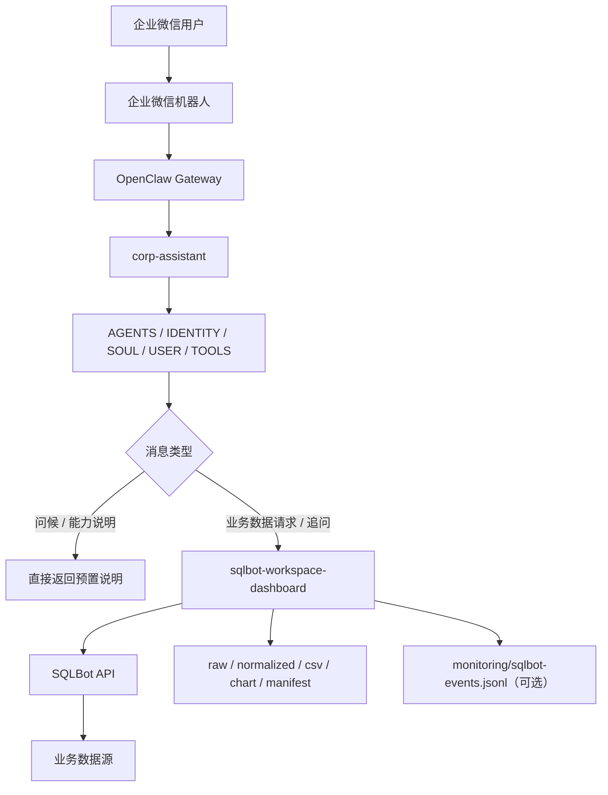

# WeCom SQL Assistant

> 企业微信自然语言数据查询集成方案 —— 基于 OpenClaw + SQLBot

用户在企业微信中直接提问，系统自动路由至 SQLBot 执行查询，并将摘要、图表和结构化产物回传至企业微信。本仓库提供 OpenClaw workspace 配置、SQLBot skill 实现和完整运行机制说明。

---

## 功能特性

- **自然语言直接提问**，无需固定命令前缀
- **会话级 SQLBot chat 复用**，同一会话内连续追问保持上下文
- **多用户隔离**，每个 OpenClaw session 独立绑定 SQLBot `chat_id`
- **workspace / datasource 按会话切换**，切换时自动清空旧 chat
- **结构化查询产物**：`raw-result.json`、`normalized.json`、`data.csv`、`chart.png`、`manifest.json`
- **结构化错误分类**：`summary.error_kind` 提供机器可读的错误类型字段
- **执行链路 Trace**：可选开启 JSONL 格式阶段埋点与 `telemetry` 返回
- **Dashboard 截图导出**（JPG / PNG / PDF，依赖 Playwright）

---

## 目录结构

```text
WeCom_SQL_Assistant/
├── readme.md
├── corp-assistant-sqlbot-workflow.md        # 完整工作流说明
└── openclaw/
    ├── AGENTS.md                            # agent 路由规则与行为约束
    ├── IDENTITY.md                          # agent 身份定义
    ├── SOUL.md                              # 输出风格约束
    ├── USER.md                              # 用户模型假设
    ├── TOOLS.md                             # 工具使用边界与可观测性说明
    ├── HEARTBEAT.md                         # 运行优先级
    └── skills/
        └── sqlbot-workspace-dashboard/
            ├── SKILL.md                     # skill 调用规范与命令模板
            ├── README.md                    # skill 说明与新特性文档
            ├── reference.md                 # 命令参考
            ├── sqlbot_skills.py             # skill 实现
            └── .env.example                 # 环境变量模板
```

---

## 系统架构



| 组件 | 职责 |
|---|---|
| 企业微信机器人 | 用户接入入口 |
| OpenClaw Gateway | channel 与 agent 绑定 |
| `corp-assistant` | 消息分类、路由规则、对外输出约束 |
| `sqlbot-workspace-dashboard` | SQLBot 查询、会话绑定、数据源切换、产物写入 |
| SQLBot | SQL 生成、查询执行、图表返回 |

---

## 前置条件

| 依赖 | 说明 |
|---|---|
| [SQLBot](https://github.com/dataease/SQLBot) | 已部署，并生成 API Access Key / Secret Key |
| OpenClaw | 已部署 |
| 企业微信机器人 | 已创建，启用长连接模式，获取 `botid` 和 `secret` |
| Python 3.9+ | 运行 `sqlbot_skills.py` |
| Pillow（可选） | 本地渲染 chart.png |
| Playwright（可选） | Dashboard 截图导出 |

企业微信机器人接入说明：[在本地终端部署 OpenClaw 并关联机器人](https://open.work.weixin.qq.com/help2/pc/21657)

---

## 部署流程

### 1. 准备 OpenClaw workspace

```bash
mkdir -p /root/.openclaw/workspace-corp-assistant-prod
cp -r openclaw/* /root/.openclaw/workspace-corp-assistant-prod/
```

### 2. 配置 SQLBot skill

```bash
cd /root/.openclaw/workspace-corp-assistant-prod/skills/sqlbot-workspace-dashboard
cp .env.example .env
# 填写以下字段
```

| 变量 | 说明 |
|---|---|
| `SQLBOT_BASE_URL` | SQLBot 服务地址 |
| `SQLBOT_API_KEY_ACCESS_KEY` | SQLBot API Access Key |
| `SQLBOT_API_KEY_SECRET_KEY` | SQLBot API Secret Key |
| `SQLBOT_API_KEY_TTL_SECONDS` | API token 过期时间（秒），默认 300 |
| `SQLBOT_TIMEOUT` | HTTP 超时时间（秒），默认 30 |
| `SQLBOT_DEFAULT_WORKSPACE` | 默认工作空间名称或 ID |
| `SQLBOT_DEFAULT_DATASOURCE` | 默认数据源名称或 ID |

> Access Key、Secret Key 和企业微信 `secret` 不得进入版本库。

### 3. 配置 OpenClaw 主配置

在 OpenClaw 环境中完成以下配置（本仓库不提供带凭据的 `openclaw.json`）：

- 配置企业微信 channel（写入 `botid` 和 `secret`）
- 注册 `corp-assistant` agent
- 将 `wecom` channel 绑定至 `corp-assistant`
- 指定 workspace 目录为 `/root/.openclaw/workspace-corp-assistant-prod`

### 4. 验证 SQLBot 连接

```bash
python3 sqlbot_skills.py workspace list
```

返回 workspace 列表即表示连接和鉴权配置有效。

### 5. 安装可选依赖

```bash
# 本地图表渲染
pip install pillow

# Dashboard 截图导出
pip install playwright
playwright install chromium
```

---

## 查询产物

每次 `ask` 在 `artifacts/` 目录写入以下文件：

```text
artifacts/
  <scope_id>/
    <YYYYMMDD-HHMMSS>-record-<id>/
      raw-result.json      # SQLBot 原始 API 响应
      normalized.json      # 归一化字段、行数据和图表方案
      data.csv             # 表格数据（有数据时生成）
      chart.png            # 渲染图表（有图表方案时生成）
      manifest.json        # trace 关联、session 信息、文件索引
```

`ask` 返回的 compact JSON 包含以下顶层字段：

| 字段 | 说明 |
|---|---|
| `summary.status` | `ok` / `empty` / `error` |
| `summary.error_kind` | 机器可读错误分类（见下表） |
| `summary.error_reason` | 人类可读错误原因 |
| `summary.summary_lines` | 面向用户的摘要 |
| `artifacts` | 产物文件路径 |
| `telemetry` | trace_id、耗时、各阶段耗时 |

**`error_kind` 取值：**

| 值 | 含义 |
|---|---|
| `null` | 查询成功 |
| `empty_result` | 查询成功但无匹配数据 |
| `auth_error` | 认证失败或权限不足 |
| `config_error` | workspace 或 datasource 不存在 |
| `network_error` | 无法连接到 SQLBot 服务 |
| `sql_execution_error` | SQL 生成或执行失败 |
| `timeout` | 请求超时 |
| `sqlbot_api_error` | 其他 SQLBot API 错误 |

---

## 结构化 Trace（可选）

`sqlbot_skills.py ask` 支持开启执行链路跟踪：

```bash
# 开启 trace，默认写入 monitoring/sqlbot-events.jsonl（skill 目录下）
python3 sqlbot_skills.py --emit-trace ask "本周各客户出货量"

# 自定义 trace 文件路径
python3 sqlbot_skills.py --trace-file /path/to/events.jsonl ask "问题"

# 指定 trace ID
python3 sqlbot_skills.py --trace-id "run-001" --emit-trace ask "问题"
```

每条事件记录一个执行阶段（JSONL 格式），包含 `trace_id`、`stage`、`status`、`duration_ms`、`error_kind` 等字段。`ask` 返回值中也包含顶层 `telemetry` 字段，提供完整的阶段耗时分解。

---

## 运维命令

> 生产流量必须显式携带 session context，禁止使用隐式 `default` scope。

```bash
# 查看当前 session 绑定
python3 sqlbot_skills.py \
  --openclaw-session-key "<sessionKey>" \
  --openclaw-agent-id "corp-assistant" \
  session show

# 发起查询
python3 sqlbot_skills.py \
  --openclaw-session-key "<sessionKey>" \
  --openclaw-agent-id "corp-assistant" \
  ask "本周各客户出货量排行"

# 强制新建 SQLBot chat
python3 sqlbot_skills.py \
  --openclaw-session-key "<sessionKey>" \
  --openclaw-agent-id "corp-assistant" \
  ask --new-chat "重新从客户维度分析本月业务量"

# 切换 datasource
python3 sqlbot_skills.py \
  --openclaw-session-key "<sessionKey>" \
  --openclaw-agent-id "corp-assistant" \
  datasource switch "<datasource>" --workspace "<workspace>"

# 重置当前 session（保留 workspace/datasource 绑定）
python3 sqlbot_skills.py \
  --openclaw-session-key "<sessionKey>" \
  --openclaw-agent-id "corp-assistant" \
  session reset

# 完全重置（清空 workspace/datasource 绑定）
python3 sqlbot_skills.py \
  --openclaw-session-key "<sessionKey>" \
  --openclaw-agent-id "corp-assistant" \
  session reset --full
```

---

## 验收清单

| 场景 | 预期结果 |
|---|---|
| 企业微信发送问候消息 | 直接返回能力说明，不调用 SQLBot |
| 发送自然语言数据请求 | 调用 SQLBot，返回中文摘要 |
| 同一会话继续追问 | 复用当前 SQLBot chat |
| 切换 workspace / datasource | 清空旧 chat，下次提问新建 |
| `session reset` | 清空分析状态，保留 workspace/datasource |
| SQLBot 认证失败 | 返回认证失败，不说无数据 |
| SQLBot 无结果 | 返回执行成功但无匹配数据 |
| SQLBot 连接失败 | 返回无法连接问数服务 |

---

## 运行约束

- 问候类消息和功能说明请求直接由 agent 回复，不进入 SQLBot
- 数据查询请求默认路由至 SQLBot，无需 `查询` 前缀
- 对外输出为简洁中文摘要，不暴露内部路径、session key 或调试信息
- SQLBot 返回错误时按执行失败处理，不得误判为"无数据"
- `summary.error_kind` 用于程序路由，不要从人类可读文本猜错误类型

---

## 变更同步要求

涉及生产行为调整时，需同步以下文件：

1. `openclaw/AGENTS.md`
2. `openclaw/TOOLS.md`
3. `openclaw/skills/sqlbot-workspace-dashboard/SKILL.md`
4. `openclaw/skills/sqlbot-workspace-dashboard/sqlbot_skills.py`
5. `corp-assistant-sqlbot-workflow.md`
6. 本 README

---

## 示例截图

| 企业微信交互 | OpenClaw 返回 | SQLBot 查询结果 |
|---|---|---|
|  |  |  |

---

## 参考文档

- [corp-assistant-sqlbot-workflow.md](corp-assistant-sqlbot-workflow.md) — 完整工作流、状态流转、可观测性机制和验收清单
- [openclaw/skills/sqlbot-workspace-dashboard/README.md](openclaw/skills/sqlbot-workspace-dashboard/README.md) — skill 新特性说明（trace、error_kind、manifest）
- [openclaw/skills/sqlbot-workspace-dashboard/reference.md](openclaw/skills/sqlbot-workspace-dashboard/reference.md) — 命令快速参考
