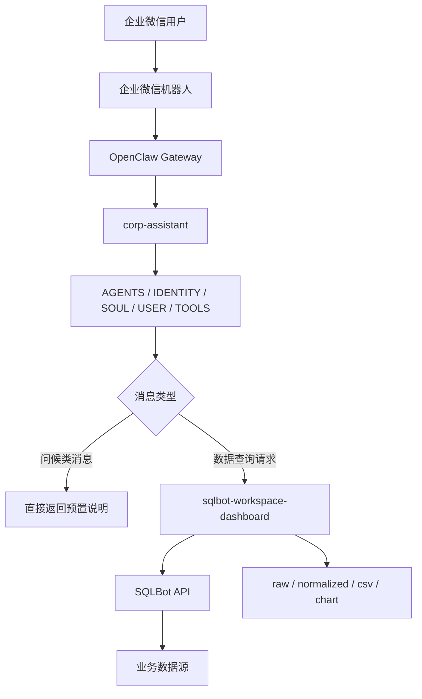
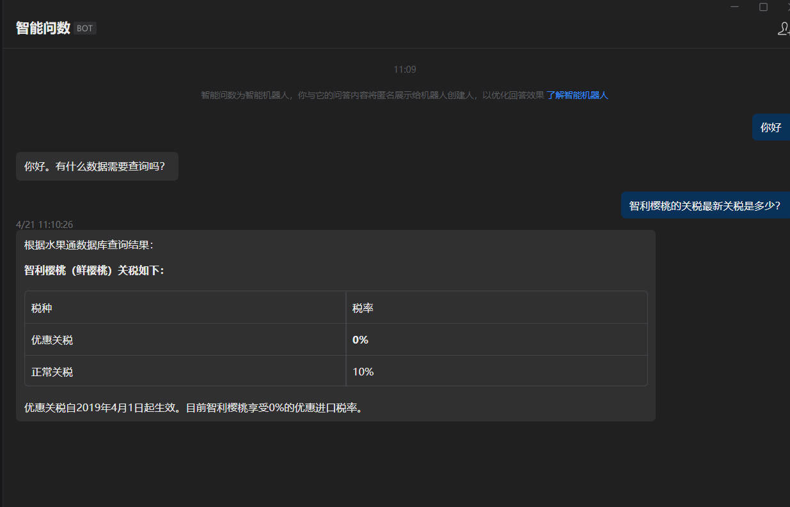
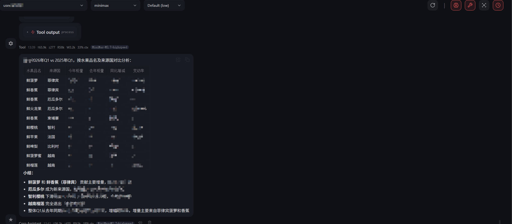
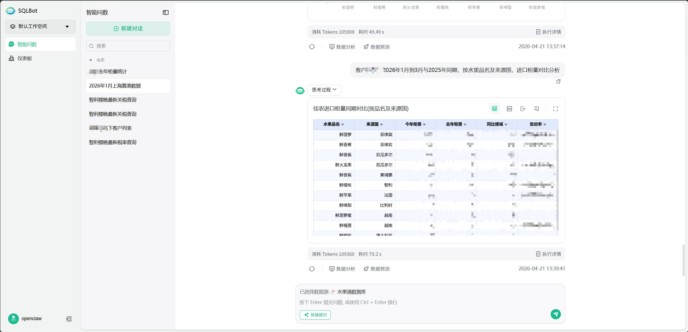

# WeCom SQL Assistant

## 项目说明

WeCom SQL Assistant 用于维护企业微信、OpenClaw 与 SQLBot 的集成部署资料。系统目标是在企业微信中提供自然语言数据查询入口，并通过 OpenClaw 完成消息路由、会话隔离、SQLBot 调用以及结果产物管理。

本仓库不包含业务系统本体，也不包含带有明文凭据的生产配置文件。仓库内容主要包括：

- OpenClaw workspace 规则文件
- SQLBot skill 及环境变量模板
- 运行机制说明文档
- 脱敏示例截图

## 目录结构

```text
WeCom_SQL_Assistant/
├─ readme.md
├─ corp-assistant-sqlbot-workflow.md
├─ 001.jpg
├─ 002.jpg
├─ 003.jpg
└─ openclaw/
   ├─ AGENTS.md
   ├─ HEARTBEAT.md
   ├─ IDENTITY.md
   ├─ SOUL.md
   ├─ TOOLS.md
   ├─ USER.md
   └─ skills/
      └─ sqlbot-workspace-dashboard/
         ├─ SKILL.md
         ├─ README.md
         ├─ reference.md
         ├─ sqlbot_skills.py
         └─ .env.example
```

主要文件说明：

- `corp-assistant-sqlbot-workflow.md`：工作流说明，包含路由、会话绑定、错误处理和产物机制
- `openclaw/AGENTS.md`：agent 运行规则与路由边界
- `openclaw/IDENTITY.md`：agent 身份定义
- `openclaw/SOUL.md`：输出风格约束
- `openclaw/USER.md`：用户模型假设
- `openclaw/TOOLS.md`：工具使用边界
- `openclaw/HEARTBEAT.md`：运行优先级
- `openclaw/skills/sqlbot-workspace-dashboard/`：SQLBot skill 实现、说明文档和环境变量模板

说明：`openclaw/` 目录用于承载 OpenClaw workspace 模板，不包含 OpenClaw 主程序，也不包含生产环境 `openclaw.json`。

## 功能范围

- 支持在企业微信中直接提交自然语言数据查询请求，无需固定命令前缀
- 支持在同一会话内复用 SQLBot chat 进行连续追问
- 支持按会话切换 workspace 和 datasource
- 支持会话级状态重置
- 支持生成查询产物，包括 `raw-result.json`、`normalized.json`、可选 `data.csv` 和 `chart.png`
- 支持 Dashboard 导出

## 系统架构



组件职责：

- 企业微信：用户接入入口
- OpenClaw Gateway：channel 与 agent 绑定
- `corp-assistant`：消息分类、运行规则和对外输出约束
- `sqlbot-workspace-dashboard`：SQLBot 查询、会话绑定、数据源切换和产物导出
- SQLBot：SQL 生成、查询执行和图表返回

## 部署前提

部署前需满足以下条件：

1. 已部署 SQLBot：<https://github.com/dataease/SQLBot>
2. 已在 SQLBot 中生成 API Key，包括 Access Key 和 Secret Key
3. 已部署 OpenClaw
4. 已在企业微信创建机器人，并启用长连接模式
5. 已获取企业微信机器人的 `botid` 和 `secret`

企业微信相关说明见：<https://open.work.weixin.qq.com/help2/pc/21657#2.2.2%E5%9C%A8%E6%9C%AC%E5%9C%B0%E7%BB%88%E7%AB%AF%E9%83%A8%E7%BD%B2OpenClaw%E5%B9%B6%E5%85%B3%E8%81%94%E6%9C%BA%E5%99%A8%E4%BA%BA>

## 部署流程

以下命令以 Linux 环境为例。Windows 本地调试时可将 `python3` 替换为 `python`。

### 1. 准备 OpenClaw workspace

将本仓库 `openclaw/` 目录同步到 OpenClaw workspace 目录：

```bash
mkdir -p /root/.openclaw/workspace-corp-assistant-prod
cp -r openclaw/* /root/.openclaw/workspace-corp-assistant-prod/
```

目标目录结构示例：

```text
/root/.openclaw/
├─ openclaw.json
└─ workspace-corp-assistant-prod/
   ├─ AGENTS.md
   ├─ HEARTBEAT.md
   ├─ IDENTITY.md
   ├─ SOUL.md
   ├─ TOOLS.md
   ├─ USER.md
   └─ skills/
      └─ sqlbot-workspace-dashboard/
```

### 2. 配置 SQLBot skill

复制环境变量模板：

```bash
cd /root/.openclaw/workspace-corp-assistant-prod/skills/sqlbot-workspace-dashboard
cp .env.example .env
```

`.env` 关键字段如下：

| 变量 | 说明 |
|---|---|
| `SQLBOT_BASE_URL` | SQLBot 服务地址 |
| `SQLBOT_API_KEY_ACCESS_KEY` | SQLBot API Access Key |
| `SQLBOT_API_KEY_SECRET_KEY` | SQLBot API Secret Key |
| `SQLBOT_API_KEY_TTL_SECONDS` | API token 过期时间 |
| `SQLBOT_TIMEOUT` | HTTP 超时时间 |
| `SQLBOT_DEFAULT_WORKSPACE` | 默认工作空间 |
| `SQLBOT_DEFAULT_DATASOURCE` | 默认数据源 |

模板内容：

```env
SQLBOT_BASE_URL=https://sqlbot.fit2cloud.cn
SQLBOT_API_KEY_ACCESS_KEY=
SQLBOT_API_KEY_SECRET_KEY=
SQLBOT_API_KEY_TTL_SECONDS=300
SQLBOT_TIMEOUT=30
SQLBOT_DEFAULT_WORKSPACE=
SQLBOT_DEFAULT_DATASOURCE=
```

真实的 Access Key、Secret Key 和企业微信 `secret` 不得进入版本库。

### 3. 配置 OpenClaw 主配置

本仓库未提供带凭据的 `openclaw.json`。实际部署时需要在 OpenClaw 环境中完成以下配置：

- 配置企业微信 channel
- 注册 `corp-assistant` agent
- 将 `wecom` channel 绑定至 `corp-assistant`
- 指定 workspace 目录为 `/root/.openclaw/workspace-corp-assistant-prod`
- 写入企业微信机器人的 `botid` 和 `secret`


### 4. 验证 SQLBot 连接

在 skill 目录执行：

```bash
cd /root/.openclaw/workspace-corp-assistant-prod/skills/sqlbot-workspace-dashboard
python3 sqlbot_skills.py workspace list
```

返回 workspace 列表表示 SQLBot 连接和鉴权配置有效。

### 5. 接入验收

验收项如下：

| 场景 | 预期结果 |
|---|---|
| 企业微信发送问候类消息 | 直接返回预置说明，不调用 SQLBot |
| 企业微信发送自然语言数据请求 | 调用 SQLBot 并返回摘要结果 |
| 同一会话继续追问 | 复用当前 SQLBot chat |
| 切换 workspace 或 datasource | 清空旧 chat 并创建新会话绑定 |
| 执行 `session reset` | 清空当前会话分析状态 |

## 会话机制

系统采用“一 OpenClaw session 对应一 SQLBot `chat_id`”的绑定策略。

运行行为如下：

- 问候类消息和功能说明请求不进入 SQLBot
- 数据查询请求默认进入 SQLBot
- 同一会话内的后续追问复用当前 SQLBot chat
- 切换 workspace 或 datasource 时，原 chat 失效并重新建立
- `session reset` 清空当前分析状态
- `session reset --full` 额外清空 workspace 与 datasource 绑定

会话状态保存在 `.sqlbot-skill-state.json`，查询产物按会话写入本地文件系统。典型产物包括：

- `raw-result.json`
- `normalized.json`
- `data.csv`
- `chart.png`

详细时序、错误分类和状态流转见 [corp-assistant-sqlbot-workflow.md](corp-assistant-sqlbot-workflow.md)。

## 运维命令

以下命令用于部署验证和运行维护。生产流量必须显式携带 session context，不得依赖默认 scope。

### 查看当前 session 绑定

```bash
python3 sqlbot_skills.py \
  --openclaw-session-key "<sessionKey>" \
  --openclaw-agent-id "corp-assistant" \
  session show
```

### 发起一次查询

```bash
python3 sqlbot_skills.py \
  --openclaw-session-key "<sessionKey>" \
  --openclaw-agent-id "corp-assistant" \
  ask "本周各客户出货量排行"
```

### 强制新建 SQLBot chat

```bash
python3 sqlbot_skills.py \
  --openclaw-session-key "<sessionKey>" \
  --openclaw-agent-id "corp-assistant" \
  ask --new-chat "重新从客户维度分析本月业务量"
```

### 切换 datasource

```bash
python3 sqlbot_skills.py \
  --openclaw-session-key "<sessionKey>" \
  --openclaw-agent-id "corp-assistant" \
  datasource switch "<datasource>" --workspace "<workspace>"
```

### 重置当前 session

```bash
python3 sqlbot_skills.py \
  --openclaw-session-key "<sessionKey>" \
  --openclaw-agent-id "corp-assistant" \
  session reset
```

运行约束：

- 生产调用前先获取当前 `sessionKey`
- 每次调用都必须传入 `--openclaw-session-key` 和 `--openclaw-agent-id`
- 生产流量不得落入隐式 `default` scope
- workspace 或 datasource 变更后，chat 重建属于预期行为

## 运行约束

`corp-assistant` 的当前职责范围限定为企业内部数据查询与分析，不包含通用聊天、编程辅助或互联网检索。

运行约束如下：

- 问候类消息和功能说明请求直接由 agent 返回预置说明
- 数据查询请求默认路由至 SQLBot
- 对外输出应为简洁中文结果摘要，不直接暴露内部实现细节
- 不向终端用户暴露工具名称、内部路径、session key 或调试信息
- SQLBot 返回错误时，应按执行失败处理，不得误判为“无数据”

相关约束由以下文件共同定义：

- [openclaw/AGENTS.md](openclaw/AGENTS.md)
- [openclaw/IDENTITY.md](openclaw/IDENTITY.md)
- [openclaw/SOUL.md](openclaw/SOUL.md)
- [openclaw/USER.md](openclaw/USER.md)
- [openclaw/TOOLS.md](openclaw/TOOLS.md)
- [openclaw/HEARTBEAT.md](openclaw/HEARTBEAT.md)
- [openclaw/skills/sqlbot-workspace-dashboard/SKILL.md](openclaw/skills/sqlbot-workspace-dashboard/SKILL.md)

## 变更同步要求

涉及生产行为调整时，应同步检查以下文件：

1. `openclaw/AGENTS.md`
2. `openclaw/skills/sqlbot-workspace-dashboard/SKILL.md`
3. `openclaw/skills/sqlbot-workspace-dashboard/sqlbot_skills.py`
4. `corp-assistant-sqlbot-workflow.md`
5. 本 README

以下场景应保证文档与实现一致：

- 路由规则变更
- 默认 datasource 变更
- session 绑定方式变更
- dashboard 导出行为变更
- 错误分类或对外输出策略变更

## 示例截图

以下截图均为脱敏示例。

### 企业微信交互示例



### OpenClaw 返回结果示例



### SQLBot 查询结果示例



## 参考文档

- [corp-assistant-sqlbot-workflow.md](corp-assistant-sqlbot-workflow.md)：完整工作流、状态流转和验收清单
- [openclaw/skills/sqlbot-workspace-dashboard/README.md](openclaw/skills/sqlbot-workspace-dashboard/README.md)：skill 说明
- [openclaw/skills/sqlbot-workspace-dashboard/reference.md](openclaw/skills/sqlbot-workspace-dashboard/reference.md)：命令参考

