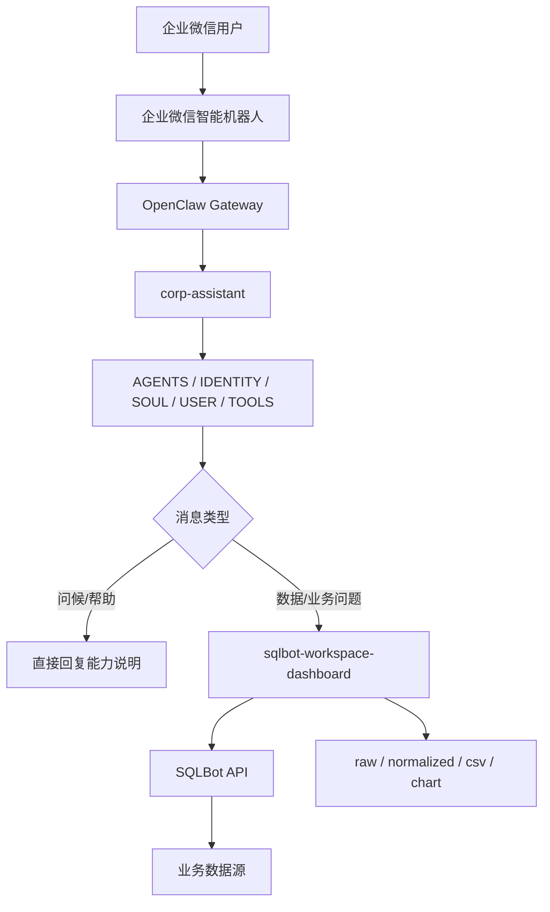

# WeCom SQL Assistant

WeCom SQL Assistant 是一个面向企业微信场景的内部数据助手方案。它通过 OpenClaw 将企业微信机器人接入 SQLBot，让用户直接在企微里用自然语言查询内部业务数据、继续追问、切换数据源，并在需要时导出图表或看板。

当前仓库不是完整的业务服务代码仓，而是这个方案的部署资料仓，主要包含：

- OpenClaw workspace 提示词与配置模板
- SQLBot skill 及其环境变量示例
- 运行机制工作文档
- 效果截图

## 仓库内容

```text
WeCom_SQL_Assistant/
├─ readme.md
├─ corp-assistant-sqlbot-workflow.md
├─ 001.jpg
├─ 002.jpg
├─ 003.jpg
└─ openclaw/
	 ├─ AGENTS.md
	 ├─ HEARTBEAT.md
	 ├─ IDENTITY.md
	 ├─ SOUL.md
	 ├─ TOOLS.md
	 ├─ USER.md
	 └─ skills/
			└─ sqlbot-workspace-dashboard/
				 ├─ SKILL.md
				 ├─ README.md
				 ├─ reference.md
				 ├─ sqlbot_skills.py
				 └─ .env.example
```

各部分作用如下：

- `corp-assistant-sqlbot-workflow.md`：完整工作流说明，包含路由、会话绑定、错误处理和产物机制
- `openclaw/AGENTS.md`：`corp-assistant` 的生产行为和路由边界
- `openclaw/IDENTITY.md`：助手身份定位
- `openclaw/SOUL.md`：回复风格约束
- `openclaw/USER.md`：目标用户假设
- `openclaw/TOOLS.md`：工具边界
- `openclaw/HEARTBEAT.md`：运行优先级
- `openclaw/skills/sqlbot-workspace-dashboard/`：SQLBot skill、说明文档和 `.env` 模板

说明：仓库中的 `openclaw/` 是 OpenClaw workspace 模板，不包含 OpenClaw 主程序本体，也不包含带有明文凭据的 `openclaw.json`。

## 方案能力

- 企业微信内直接发自然语言数据问题，不需要加“查询”前缀
- 同一会话内连续追问，复用同一个 SQLBot chat
- 支持切换 workspace 和 datasource
- 支持重新开始当前分析会话
- 支持生成查询产物，如 `raw-result.json`、`normalized.json`、可选 `data.csv`、`chart.png`
- 如已配置，可导出 dashboard 截图或文件

## 总体架构



推荐的生产职责分层：

- 企业微信：用户入口
- OpenClaw Gateway：channel 与 agent 绑定
- `corp-assistant`：企业内部数据助手人格与路由规则
- `sqlbot-workspace-dashboard`：SQLBot 查询、会话绑定、数据源切换、产物导出
- SQLBot：生成 SQL、执行查询、返回数据与图表

## 部署前提

在开始部署前，至少需要准备好以下内容：

1. 已部署 SQLBot：<https://github.com/dataease/SQLBot>
2. 已在 SQLBot 中生成 API Key，包含 Access Key 和 Secret Key
3. 已部署 OpenClaw
4. 已在企业微信创建智能机器人，并使用长连接模式
5. 已记录企业微信机器人 `botid` 和 `secret`

企业微信官方说明可参考：<https://open.work.weixin.qq.com/help2/pc/21657#2.2.2%E5%9C%A8%E6%9C%AC%E5%9C%B0%E7%BB%88%E7%AB%AF%E9%83%A8%E7%BD%B2OpenClaw%E5%B9%B6%E5%85%B3%E8%81%94%E6%9C%BA%E5%99%A8%E4%BA%BA>

## 部署步骤

以下示例以 Linux 服务器部署 OpenClaw 为例。若在 Windows 本地调试，可将 `python3` 替换为 `python`。

### 1. 准备 OpenClaw workspace

将仓库中的 `openclaw/` 内容同步到实际 OpenClaw workspace 目录，例如：

```bash
mkdir -p /root/.openclaw/workspace-corp-assistant-prod
cp -r openclaw/* /root/.openclaw/workspace-corp-assistant-prod/
```

部署完成后，典型目录类似：

```text
/root/.openclaw/
├─ openclaw.json
└─ workspace-corp-assistant-prod/
	 ├─ AGENTS.md
	 ├─ HEARTBEAT.md
	 ├─ IDENTITY.md
	 ├─ SOUL.md
	 ├─ TOOLS.md
	 ├─ USER.md
	 └─ skills/
			└─ sqlbot-workspace-dashboard/
```

### 2. 配置 SQLBot skill

进入 skill 目录，复制环境变量模板：

```bash
cd /root/.openclaw/workspace-corp-assistant-prod/skills/sqlbot-workspace-dashboard
cp .env.example .env
```

`.env` 至少需要配置这些字段：

| 变量 | 说明 |
|---|---|
| `SQLBOT_BASE_URL` | SQLBot 服务地址 |
| `SQLBOT_API_KEY_ACCESS_KEY` | SQLBot API Access Key |
| `SQLBOT_API_KEY_SECRET_KEY` | SQLBot API Secret Key |
| `SQLBOT_API_KEY_TTL_SECONDS` | API token 过期时间 |
| `SQLBOT_TIMEOUT` | HTTP 超时时间 |
| `SQLBOT_DEFAULT_WORKSPACE` | 默认工作空间，可选 |
| `SQLBOT_DEFAULT_DATASOURCE` | 默认数据源，可选 |

`.env.example` 内容示例：

```env
SQLBOT_BASE_URL=https://sqlbot.fit2cloud.cn
SQLBOT_API_KEY_ACCESS_KEY=
SQLBOT_API_KEY_SECRET_KEY=
SQLBOT_API_KEY_TTL_SECONDS=300
SQLBOT_TIMEOUT=30
SQLBOT_DEFAULT_WORKSPACE=
SQLBOT_DEFAULT_DATASOURCE=
```

注意：不要把真实的 Access Key、Secret Key、企业微信 secret 提交到仓库。

### 3. 配置 OpenClaw 主配置

本仓库没有提交带凭据的 `openclaw.json`，需要在 OpenClaw 实际环境中自行完成以下配置：

- 配置企业微信 channel
- 注册 `corp-assistant` 这个 agent
- 将 `wecom` channel 绑定到 `corp-assistant`
- 指向上一步复制好的 workspace 目录
- 写入企业微信机器人的 `botid` 和 `secret`

建议把所有明文敏感信息只放在服务器配置文件中，不写入本仓库。

### 4. 验证 SQLBot 连接

先在 skill 目录做一次连通性验证：

```bash
cd /root/.openclaw/workspace-corp-assistant-prod/skills/sqlbot-workspace-dashboard
python3 sqlbot_skills.py workspace list
```

如果命令能正常返回 workspace 列表，说明 SQLBot 基础连接和鉴权大体正常。

### 5. 验证企业微信入口

推荐按以下顺序验收：

1. 企业微信发送“你好”
2. 应返回能力说明，且不触发 SQLBot 查询
3. 企业微信发送自然语言数据问题，例如“本周各客户出货量排行”
4. 应触发 SQLBot 并返回简短业务摘要
5. 继续发送“按地区拆分”之类的追问，确认会复用同一会话

## 会话机制

当前方案的核心设计是：一个 OpenClaw session 对应一个 SQLBot `chat_id`。

这意味着：

- 问候、帮助、能力介绍不走 SQLBot
- 自然语言业务/数据问题默认走 SQLBot
- 同一会话内的追问复用当前 SQLBot chat
- 切换 workspace 或 datasource 后，旧 chat 会失效并重新建立
- `session reset` 只清空当前分析状态
- `session reset --full` 还会清空 workspace 和 datasource 绑定

skill 会把当前会话状态保存在 `.sqlbot-skill-state.json`，并在查询后生成产物文件。典型产物包括：

- `raw-result.json`
- `normalized.json`
- `data.csv`
- `chart.png`

更完整的时序、错误处理和状态流转说明，请直接阅读 [corp-assistant-sqlbot-workflow.md](corp-assistant-sqlbot-workflow.md)。

## 常用命令

以下命令主要用于运维和验证。生产流量必须携带显式 session context，不要使用默认 scope。

### 查看当前 session 绑定

```bash
python3 sqlbot_skills.py \
	--openclaw-session-key "<sessionKey>" \
	--openclaw-agent-id "corp-assistant" \
	session show
```

### 发起一次数据提问

```bash
python3 sqlbot_skills.py \
	--openclaw-session-key "<sessionKey>" \
	--openclaw-agent-id "corp-assistant" \
	ask "本周各客户出货量排行"
```

### 强制新建一个 SQLBot chat

```bash
python3 sqlbot_skills.py \
	--openclaw-session-key "<sessionKey>" \
	--openclaw-agent-id "corp-assistant" \
	ask --new-chat "重新从客户维度分析本月业务量"
```

### 切换 datasource

```bash
python3 sqlbot_skills.py \
	--openclaw-session-key "<sessionKey>" \
	--openclaw-agent-id "corp-assistant" \
	datasource switch "<datasource>" --workspace "<workspace>"
```

### 重置当前 session

```bash
python3 sqlbot_skills.py \
	--openclaw-session-key "<sessionKey>" \
	--openclaw-agent-id "corp-assistant" \
	session reset
```

重要约束：

- 生产调用前应先获取当前 `sessionKey`
- 每次调用都应传入 `--openclaw-session-key` 和 `--openclaw-agent-id`
- 不要让生产流量落入隐式 `default` scope
- 如果用户切换数据源或工作空间，应接受 chat 被重建这一行为

## 运行规则摘要

`corp-assistant` 当前是一个窄口企业内部数据助手，不是通用聊天、编码或联网搜索助手。

生产行为建议保持如下约束：

- 用户打招呼或询问“你能做什么”时，直接回复能力介绍
- 用户询问业务/数据问题时，默认走 SQLBot
- 尽量使用简短、业务化、面向结果的中文回复
- 不向普通用户暴露 tool 名称、内部路径、session key 或原始 debug 信息
- SQLBot 报错时，要明确说明是执行失败，而不是误说成“没有数据”

这些规则分别由下列文件协同约束：

- [openclaw/AGENTS.md](openclaw/AGENTS.md)
- [openclaw/IDENTITY.md](openclaw/IDENTITY.md)
- [openclaw/SOUL.md](openclaw/SOUL.md)
- [openclaw/USER.md](openclaw/USER.md)
- [openclaw/TOOLS.md](openclaw/TOOLS.md)
- [openclaw/HEARTBEAT.md](openclaw/HEARTBEAT.md)
- [openclaw/skills/sqlbot-workspace-dashboard/SKILL.md](openclaw/skills/sqlbot-workspace-dashboard/SKILL.md)

## 维护建议

如果后续修改了生产行为，建议至少同步检查以下内容：

1. `openclaw/AGENTS.md`
2. `openclaw/skills/sqlbot-workspace-dashboard/SKILL.md`
3. `openclaw/skills/sqlbot-workspace-dashboard/sqlbot_skills.py`
4. `corp-assistant-sqlbot-workflow.md`
5. 本 README

特别是以下场景要保持文档和实现一致：

- 变更路由规则
- 变更默认 datasource
- 变更 session 绑定方式
- 变更 dashboard 导出行为
- 变更错误分类或用户回复策略

## 效果示例

以下截图均为脱敏示例。

### 企业微信侧会话示例


### OpenClaw 侧返回示例


### SQLBot 执行结果示例


## 参考文档

- [corp-assistant-sqlbot-workflow.md](corp-assistant-sqlbot-workflow.md)：完整工作流、状态流转和验收清单
- [openclaw/skills/sqlbot-workspace-dashboard/README.md](openclaw/skills/sqlbot-workspace-dashboard/README.md)：skill 快速说明
- [openclaw/skills/sqlbot-workspace-dashboard/reference.md](openclaw/skills/sqlbot-workspace-dashboard/reference.md)：更多命令参考

## 一句话总结

这个项目的目标，是把企业微信入口、OpenClaw 会话管理和 SQLBot 数据查询能力组合成一个可维护、可扩展、会话隔离清晰的企业内部数据助手。

